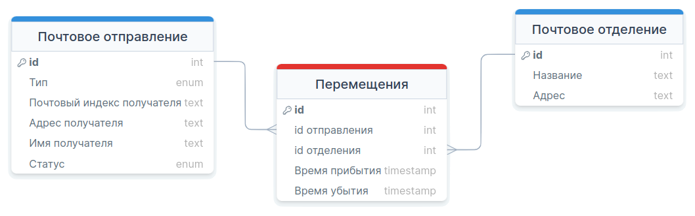
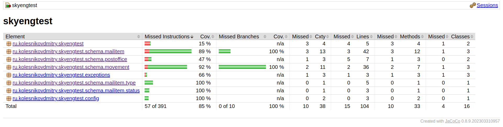
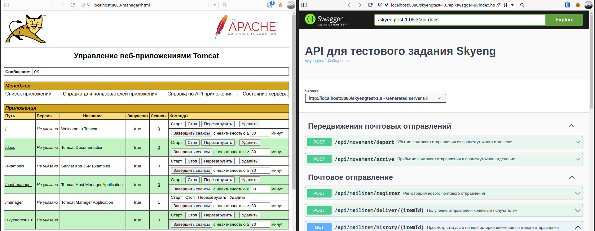

# Тестовое задание Skyeng на Java Junior

Колесников Д.А.

Swagger для развёрнутого приложения по ссылке:

[http://194.58.107.251:8080/skyengtest-1.0/api/swagger-ui/index.html#/](http://194.58.107.251:8080/skyengtest-1.0/api/swagger-ui/index.html#/)

Скриншот из Tomcat ниже, в "Деплой". WAR с выполненным заданием - в этой папке. [skyengtest-1.0.war](skyengtest-1.0.war).

Для запуска должны быть настроены переменные среды:

```
DB_URL=jdbc:postgresql://localhost:5432/skyengtest
DB_USER=user
DB_PASSWORD=password
DDL_BEHAVIOUR=update
```

# API

Оффлайн-версия API лежит здесь в папке [в pdf](readme-files/open-api.pdf)

Онлайн версия находится по пути /api/docs запущенного приложения и представляет собой документацию OpenAPI

Если коротко, то запросы получились такие:

1. Регистрация нового почтового отправления

```
/api/mailitem/register
```

2. Прибытие почтового отправления в промежуточное отделение

```
/api/movement/arrive
```

3. Убытие почтового отправления из промежуточного отделения

```
/api/movement/depart
```

4. Получение отправления конечным получателем

```
/api/mailitem/deliver/{itemId}
```

5. Просмотр статуса и полной истории движения почтового отправления

```
/api/mailitem/history/{itemId}
```

# Схема данных

Выделено 3 сущности. Из них 2 по заданию - Почтовое отправление и Почтовое отделение. Дополнительно таблица Перемещения - для отслеживания



# Покрытие тестами

Реализованы позитивные и негативные автотесты. Покрытие - 85%. Непокрытыми остались конфиги, main и т.д. Весь функционал по заданию покрыт



# Деплой

Приложение собрано в war-архив и запускается с помощью Apache Tomcat 10



# Технологии

- Стек: Spring
- Способ передачи данных: JSON
- СУБД: PostgreSQL
- Реализация ORM: Hibernate
- Система сборки: Gradle
